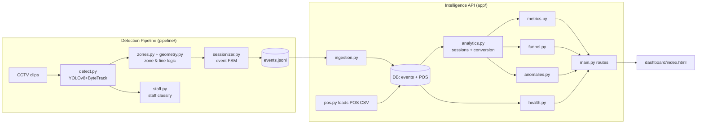
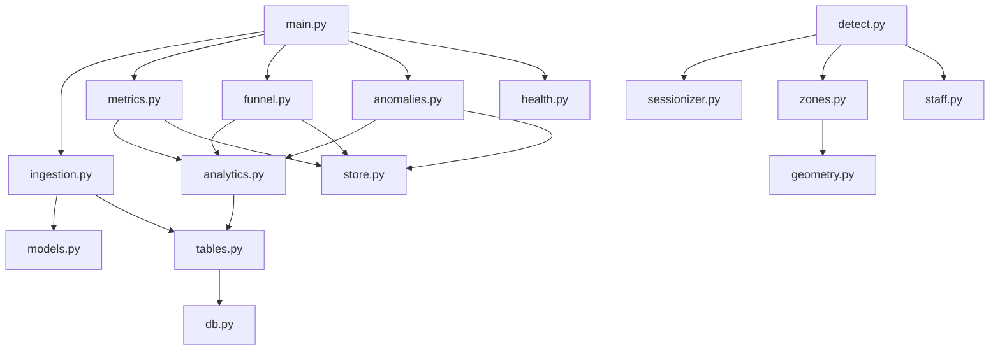
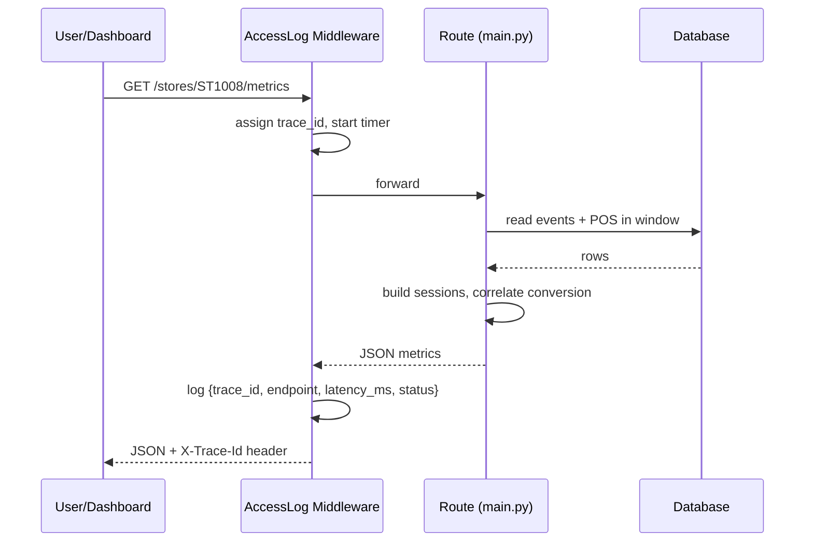
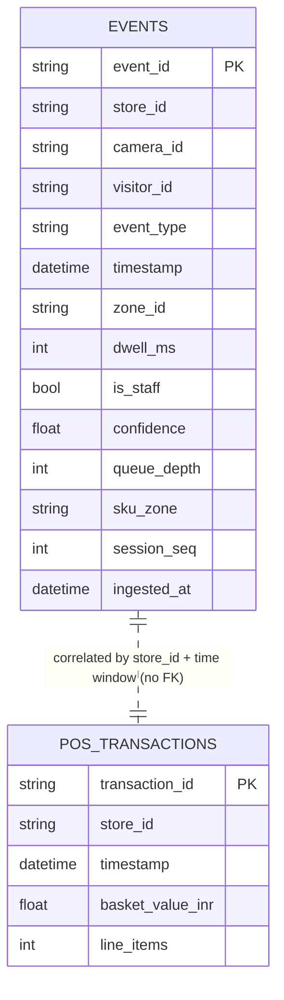
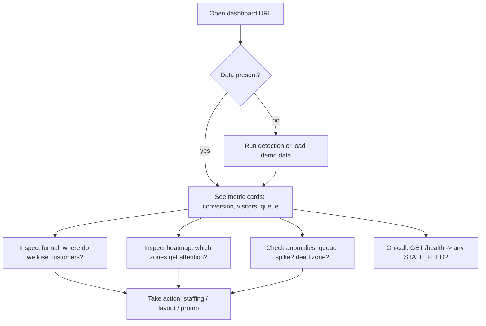

# Store Intelligence — Complete Project Guide & Interview Handbook

> A beginner-friendly, end-to-end documentation package for the **Store Intelligence** project.
> Written so a school student can follow it, then deep enough to defend every line in an interview.

---

# PART 1 — PROJECT OVERVIEW

**Project Name:** Store Intelligence

**Tagline:** *"Turn ordinary CCTV footage into live store analytics — and measure how many shoppers actually buy."*

**Problem Statement:**
Online shops know everything about their customers — every click, every page, every drop-off. Physical (offline) stores are blind. A shopkeeper does not know how many people walked in, where they spent time, where they got bored and left, or how many actually bought something. This project builds a system that watches the store's existing CCTV cameras and turns that video into the same kind of analytics an online shop has.

**Real-world Problem Being Solved:**
A retail chain (in the brief, "Apex Retail" / in our real data, a Purplle cosmetics store) has cameras but no insight. They want to know, in plain numbers: *How many unique visitors today? How many converted to a sale? Where are we losing them? Is a queue building up right now?*

**Why This Project Is Important:**
- Offline retail is still the majority of shopping, yet it is a "data blind spot."
- Better data → better staffing, better shelf layout, fewer lost sales.
- It reuses cameras the store **already owns** — no new expensive hardware.

**Target Users:**
- **Store managers** — daily metrics, queue alerts.
- **Regional/operations heads** — compare stores, spot problems.
- **On-call engineers** — is a camera feed down? (the `/health` endpoint).
- **Merchandising teams** — which zones get attention but no sales (heatmap + funnel).

**Expected Benefits:**
- Know the **offline conversion rate** (the "north-star" number).
- Detect operational problems live (queue spikes, dead zones, conversion drops).
- Make the invisible visible: footfall, dwell time, funnel drop-off.

---

# PART 2 — EXECUTIVE SUMMARY (one page)

**Store Intelligence** is a containerised, end-to-end analytics system that converts raw retail CCTV footage into a live "Store Intelligence API." A computer-vision pipeline (YOLOv8 + ByteTrack) detects and tracks people across store cameras, classifies staff vs customers, and emits a stream of structured **behavioural events** (entry, zone dwell, billing-queue join, exit, re-entry). A FastAPI service ingests those events into a database (PostgreSQL in production, SQLite for local/test), then computes real-time metrics: unique visitors, **offline conversion rate**, a conversion funnel, a zone heatmap, operational anomalies, and a health/feed-status endpoint. A web dashboard shows the metrics updating live.

The system is built **production-aware**: one-command startup (`docker compose up`), structured JSON request logging with trace IDs, idempotent ingestion, graceful database-down handling (HTTP 503, no stack traces), and a test suite with ~93% coverage covering the tricky edge cases (groups, staff, re-entry, empty store, zero purchases). It maps directly to a hiring-challenge rubric (Detection 30 / API 35 / Production 20 / AI-Engineering 15 / Dashboard +10).

**Use it as:**
- *Hackathon submission:* "End-to-end CCTV → live retail analytics API, containerised, with conversion-rate as the north-star metric."
- *Resume line:* "Built a containerised computer-vision + FastAPI analytics platform that turns retail CCTV into real-time conversion metrics."
- *LinkedIn:* "Shipped Store Intelligence — YOLOv8/ByteTrack detection → event stream → FastAPI metrics/funnel/anomalies → live dashboard, fully Dockerised with 93% test coverage."

---

# PART 3 — BEGINNER-FRIENDLY EXPLANATION

**What this project does (in one sentence):** it watches store cameras and produces a live "report card" of how the store is performing.

**Analogy — the librarian:** Just like a librarian watches who enters the library, notices which shelves people browse, sees who checks out a book, and can tell you "20 people came in, 8 borrowed books" — this project does the same for a shop, automatically, from video.

**How users interact with it:**
- A manager opens a web page (**the dashboard**) and sees big number cards: *Conversion Rate, Unique Visitors, Queue Depth, Abandonment.*
- A developer or another program calls the **API** (web addresses like `/stores/ST1008/metrics`) and gets the numbers back as JSON (machine-readable text).

**What happens behind the scenes (the assembly line):**
1. **Cameras → Detection.** The video is fed to an AI model that finds people in each frame and follows each person frame-to-frame (tracking), giving each a temporary ID.
2. **Detection → Events.** When a person crosses the doorway, enters a shelf area, or joins the billing queue, the system writes a small structured note called an **event** (like a diary entry: *"visitor V5 entered SKINCARE at 3:02 pm"*).
3. **Events → Database.** All events are stored in a database.
4. **Database → Metrics.** When you ask for metrics, the API reads the events, groups them per visitor ("sessions"), correlates them with the cash-register (POS) sales, and computes the numbers.
5. **Metrics → Dashboard.** The web page polls the API and refreshes the numbers so they look "live."

**Simple example:** Three friends walk in together → the camera sees 3 people → 3 "ENTRY" events → the dashboard's "Unique Visitors" goes up by 3 (not 1). One of them pays → that becomes a "converted" visitor → conversion rate updates.

---

# PART 4 — COMPLETE FEATURE BREAKDOWN

| Feature | Purpose | Input | Processing | Output | User Benefit |
|---|---|---|---|---|---|
| **Person detection & tracking** | Find & follow people in video | CCTV clip frames | YOLOv8 detects people; ByteTrack assigns a track id per person | Per-frame person positions with ids | Foundation for every count |
| **Entry/Exit direction** | Count people entering vs leaving | Track foot positions over time | Geometry: did the track cross the doorway line, inward or outward? | ENTRY / EXIT events | Accurate footfall |
| **Zone attribution** | Know which shelf area a person is in | Foot point + zone polygons | Ray-casting point-in-polygon test | ZONE_ENTER / ZONE_DWELL / ZONE_EXIT | Heatmap & funnel |
| **Re-entry handling** | Don't double-count someone who steps out & returns | Boundary crossings + prior state | If a track exits then re-enters → REENTRY, not a 2nd ENTRY | REENTRY event | Honest visitor counts |
| **Group handling** | Count individuals, not groups | Multiple tracks at once | Each person = own track = own ENTRY | N ENTRY events | Correct counts |
| **Staff exclusion** | Remove employees from customer stats | Track lifetimes + POS staff count (+ optional Claude Vision) | Longest-present, widest-roaming N tracks flagged staff | `is_staff=true` events | Customer-only metrics |
| **Confidence calibration** | Don't hide uncertain detections | Detection confidence | Low-confidence events are **kept and flagged**, never dropped | `confidence` on every event | Trustworthy data |
| **Event ingestion** | Accept events safely | Batch of ≤500 events | Validate each, dedup by `event_id`, partial success | IngestResult (accepted/duplicates/rejected) | Reliable pipeline |
| **Metrics** | The headline numbers | Events + POS, time window | Sessionise, correlate billing→POS | unique visitors, conversion, dwell, queue, abandonment | Daily decisions |
| **Funnel** | Where customers drop off | Sessions | Entry→Zone→Billing→Purchase counts + drop-off % | Funnel stages | Find the leak |
| **Heatmap** | Which zones get attention | Sessions | Visit counts + avg dwell normalised 0–100 | Per-zone scores + confidence flag | Merchandising |
| **Anomalies** | Live operational alerts | Events + POS history | Queue spike, conversion drop vs 7-day avg, dead zone | Severity + suggested_action | Act now |
| **Health** | Is the system/feed OK? | Latest event per camera | Compare each camera's lag to store's latest event | status + per-camera STALE_FEED | On-call confidence |
| **Live dashboard** | Human-friendly view | API responses | Browser polls `/metrics` etc. | Auto-refreshing web page | At-a-glance status |
| **Replay simulator** | Demo "live" behaviour | events.jsonl | Streams events over time | Dashboard fills in real time | Proves it's connected |
| **Camera selection** (`--cameras`) | Choose which cameras to run/show | "2 3 1" / "all" | Filter cameras in detection or simulation | Subset of cameras | Flexible demos |

---

# PART 5 — TECHNOLOGY STACK

| Layer | Technology | What it is | Why it's used | Advantages |
|---|---|---|---|---|
| **Detection** | **YOLOv8** (Ultralytics) | A fast object-detection neural network | Detect "person" in each frame | State-of-the-art speed/accuracy, easy API |
| **Tracking** | **ByteTrack** | A multi-object tracker | Keep the same id on a person across frames | Strong on occlusion, built into Ultralytics |
| **CV plumbing** | **OpenCV**, **NumPy**, **PyTorch** | Video I/O, math, deep-learning runtime | Read frames, run the model | Industry standard |
| **Optional VLM** | **Claude Vision** (anthropic SDK) | A vision language model | Borderline staff-vs-customer calls | Plug-in, only if API key set |
| **Backend / API** | **FastAPI** | A modern Python web framework | Build the REST API | Fast, auto-docs (`/docs`), Pydantic validation |
| **Server** | **Uvicorn** | An ASGI web server | Run the FastAPI app | High performance |
| **Validation** | **Pydantic v2** | Data-validation library | Enforce the event schema | Catches bad data at the door |
| **ORM / DB access** | **SQLAlchemy 2.0** | Object-relational mapper | Talk to the database in Python | DB-agnostic (SQLite ↔ Postgres) |
| **Database** | **PostgreSQL** (prod) / **SQLite** (local & tests) | Relational databases | Store events & POS | Postgres for concurrency; SQLite for zero-setup |
| **Containerisation** | **Docker + Docker Compose** | Package & orchestrate services | One-command startup | Runs identically anywhere |
| **Testing** | **pytest + pytest-cov + httpx** | Test framework & HTTP test client | Verify behaviour, measure coverage | ~93% coverage |
| **Dashboard** | **HTML + JavaScript** (vanilla) | A single web page | Show live metrics | No build step, trivially served |

---

# PART 6 — PROJECT ARCHITECTURE

### High-level (ASCII)

```
 ┌──────────┐   ┌───────────────┐   ┌──────────────┐   ┌────────────────┐   ┌─────────────┐
 │ CCTV mp4 │ → │  Detection    │ → │ events.jsonl │ → │ Intelligence   │ → │  Dashboard  │
 │ (5 cams) │   │ YOLOv8+Byte   │   │ (event       │   │ API (FastAPI + │   │ (web, polls │
 │          │   │ Track + zones │   │  stream)     │   │ DB + analytics)│   │  /metrics)  │
 └──────────┘   └───────────────┘   └──────────────┘   └───────┬────────┘   └─────────────┘
                                                                │ correlate
                                                        ┌───────▼────────┐
                                                        │ POS sales CSV  │
                                                        └────────────────┘
```

### Component diagram (Mermaid)



### Module diagram (Mermaid)



### Data flow (request lifecycle)



---

# PART 7 — FOLDER STRUCTURE ANALYSIS

| Path | Purpose / Responsibility | Key functions / classes | Depends on |
|---|---|---|---|
| `app/main.py` | FastAPI entrypoint: startup, error handlers, all routes | `lifespan`, route handlers, `_error_body` | all `app/*` modules |
| `app/config.py` | Central settings from env vars with defaults | `Settings`, `settings` | env |
| `app/db.py` | DB engine/session; graceful-degradation dependency | `Base`, `get_db`, `init_db`, `db_alive`, `DatabaseUnavailable` | SQLAlchemy, config |
| `app/tables.py` | ORM tables | `Event`, `PosTransaction` | db.py |
| `app/models.py` | Pydantic schemas (the event contract) | `EventIn`, `EventType`, `IngestBatch`, `IngestResult` | pydantic |
| `app/ingestion.py` | Validate + dedup + store events | `ingest_events`, `ingest_jsonl` | models, tables |
| `app/analytics.py` | Core: windows, sessions, conversion | `build_sessions`, `apply_conversion`, `visitor_sessions`, `resolve_window`, `feed_now` | tables, config |
| `app/metrics.py` | `/metrics` and `/heatmap` computation | `compute_metrics`, `compute_heatmap` | analytics, store |
| `app/funnel.py` | `/funnel` computation | `compute_funnel` | analytics, store |
| `app/anomalies.py` | `/anomalies` detection | `compute_anomalies` | analytics, store, tables |
| `app/health.py` | `/health` status + STALE_FEED | `compute_health` | tables, db, config |
| `app/pos.py` | Load POS CSV into DB (idempotent) | `load_pos` | tables, config |
| `app/store.py` | Read store_layout.json metadata | `layout`, `zone_types`, `floor_zone_ids` | config |
| `app/logging_mw.py` | Structured JSON request logging | `AccessLogMiddleware`, `configure_logging` | starlette |
| `app/Dockerfile` | Build the API image | — | requirements.txt |
| `pipeline/detect.py` | Detection driver (the only GPU part) | `process_camera`, `resolve_cameras`, `main` | sessionizer, zones, staff |
| `pipeline/sessionizer.py` | Pure FSM turning observations into events | `Observation`, `Sessionizer`, `process_observations` | — |
| `pipeline/zones.py` | Per-camera zone & entry-line resolver | `CameraZones`, `StoreZones` | geometry |
| `pipeline/geometry.py` | Pure geometry (point-in-poly, crossings) | `point_in_polygon`, `crossing_direction`, `bbox_foot` | — |
| `pipeline/staff.py` | Staff classification (heuristic + VLM) | `classify_by_heuristic`, `classify_crop_with_vlm`, `STAFF_VLM_PROMPT` | (anthropic optional) |
| `pipeline/calibrate.py` | Draw zones on real frames to tune polygons | calibration helper | cv2 |
| `pipeline/Dockerfile.gpu`, `run.sh` | GPU image + run script | — | requirements-pipeline.txt |
| `scripts/prepare_data.py` | Normalise raw POS export → clean CSV + staff roster | `main`, `parse_ts` | csv |
| `scripts/simulate_events.py` | Generate realistic multi-camera demo events | `build`, `EventWriter`, `cam_for_zone`, `resolve_cameras` | layout, POS |
| `scripts/replay_events.py` | Stream events over time for a live demo | replay loop | requests |
| `data/store_layout.json` | Store/zone/camera definitions | — | — |
| `data/pos_transactions.csv` | Clean POS transactions (24) | — | — |
| `data/staff_roster.json` | Known staff (5) | — | — |
| `data/events.jsonl` | The event stream (demo dataset) | — | — |
| `dashboard/index.html` | Live web dashboard | — | API |
| `tests/test_*.py` | pytest suite (8 files, prompt blocks) | — | app |
| `docker-compose.yml` | Orchestrates db + api + pipeline | — | Dockerfiles |
| `docs/DESIGN.md`, `docs/CHOICES.md` | Architecture & decision docs | — | — |
| `.vscode/tasks.json` | Click-to-run menu (start/demo/detect) | — | — |

---

# PART 8 — COMPLETE CODE EXPLANATION (file by file)

> Convention used below: **What / Inputs / Outputs / Logic / Complexity.**

### `app/main.py`
- **What:** Wires the whole API together.
- **`lifespan`** — runs once at startup: configures logging, creates tables (`init_db`), loads POS, and auto-ingests `events.jsonl` so the API has data on a cold start. *Inputs:* none. *Outputs:* a ready app. *Logic:* `async` context manager; failures during seeding are logged, not fatal.
- **Error handlers** — `DatabaseUnavailable`/`OperationalError` → **HTTP 503** structured body; any other exception → **500** with no stack trace. This is the "graceful degradation" requirement.
- **Routes:** `/health`, `POST /events/ingest` (+ `/events/ingest/raw` lenient variant), `/stores/{id}/metrics|funnel|heatmap|anomalies`, `/dashboard`, `/`. Each route is a thin wrapper delegating to a module — keeps HTTP separate from logic.
- **Complexity:** routing is O(1); cost is in the analytics modules.

### `app/config.py`
- **What:** one `Settings` object reading env vars with sensible defaults (DB URL defaults to SQLite; conversion window 5 min; stale-feed 10 min; dead-zone 30 min; queue-spike depth 5; batch cap 500). Centralising config means business knobs are tunable without code edits.

### `app/db.py`
- **`_make_engine`** — builds the SQLAlchemy engine; for SQLite adds `check_same_thread=False`; for Postgres sets a connection pool. `pool_pre_ping=True` avoids stale connections.
- **`get_db`** — FastAPI dependency that yields a session and converts connection errors into `DatabaseUnavailable` (→ 503). *Logic:* try/yield/finally close.
- **`db_alive`** — `SELECT 1` liveness probe used by `/health`.
- **`init_db`** — `create_all` (create tables if missing).

### `app/tables.py`
- **`Event`** — primary key `event_id` (this is what makes ingestion idempotent). Indexed columns: store_id, visitor_id, event_type, ts, zone_id, is_staff. Metadata flattened into `queue_depth/sku_zone/session_seq`. A composite index `(store_id, ts)` matches the hot query.
- **`PosTransaction`** — `transaction_id` PK, store_id, ts, basket_value_inr, line_items.

### `app/models.py`
- **`EventType`** — enum of the 8 allowed event types (rejects anything else).
- **`EventIn`** — the event contract. `confidence` constrained to 0..1. A validator forces timestamps to be timezone-aware UTC.
- **`IngestResult`** — received/accepted/duplicates/rejected + per-item rejection detail (enables **partial success**).

### `app/ingestion.py`
- **`ingest_events`** — *Inputs:* list of raw dicts. *Logic:* (1) validate each with Pydantic; bad ones go to `rejected` with their index+reason (partial success). (2) Idempotency: look up existing `event_id`s and skip duplicates (also dedup within the batch). (3) `db.merge` (upsert-safe) the new rows. *Output:* `IngestResult`. *Complexity:* O(n) over the batch + one `IN (...)` query.
- **`ingest_jsonl`** — reads a `.jsonl` file and calls `ingest_events` (used at startup).

### `app/analytics.py` (the heart)
- **`feed_now`** — latest event timestamp for a store = the system's "current time" (the **feed clock**). Lets recorded footage behave like a live feed.
- **`resolve_window`** — returns `[start, end)` for "today" = most recent day that has events (or an explicit `?date`).
- **`build_sessions`** — collapses the event stream into one `VisitorSession` per `visitor_id`: did they enter? reach billing? which floor zones? max queue depth? dwell per zone? *Complexity:* O(n) over events.
- **`visitor_sessions`** — keeps only sessions that actually **entered** (ENTRY/REENTRY/EXIT seen). *This is the key line that makes anonymous side-camera tracks enrich the heatmap but NOT inflate visitor counts.*
- **`apply_conversion`** — for each POS transaction, mark any session that had **billing presence within 5 minutes before** the sale as `converted`. Correlation is **time + store** (no customer_id exists). *Complexity:* O(transactions × sessions) — fine for a store-day.

### `app/metrics.py`
- **`compute_metrics`** — unique visitors, converted, **conversion_rate = converted/unique**, attributed transactions, avg dwell per zone, current/max queue depth, billing visitors, abandonment rate. Staff excluded; zero-visitor stores return 0.0 (no divide-by-zero).
- **`compute_heatmap`** — per floor zone: visits + avg dwell, each normalised to 0–100; `data_confidence="low"` when fewer than 20 sessions.

### `app/funnel.py`
- **`compute_funnel`** — Entry → Zone Visit → Billing Queue → Purchase, with counts and drop-off %. Unit is the **session**, so re-entries don't double-count.

### `app/anomalies.py`
- **`compute_anomalies`** — three detectors: (1) **BILLING_QUEUE_SPIKE** (queue ≥ threshold; CRITICAL at 2× threshold); (2) **CONVERSION_DROP** vs trailing 7-day average (WARN if today < 70% of baseline; INFO if not enough history); (3) **DEAD_ZONE** (a floor zone with no visit in the last 30 min). Each anomaly carries a `severity` and a `suggested_action`.

### `app/health.py`
- **`compute_health`** — DB up/down + per-camera last-event timestamp; flags `STALE_FEED` when a camera lags the store's latest event by > 10 min. Overall status `ok`/`degraded`.

### `app/pos.py`
- **`load_pos`** — reads the POS CSV, inserts new transactions (idempotent by `transaction_id`).

### `app/store.py`
- Reads `store_layout.json` (cached) and exposes `zone_types()` (zone → entry/floor/billing) and `floor_zone_ids()`.

### `app/logging_mw.py`
- **`AccessLogMiddleware`** — for every request: generate a `trace_id`, time it, and log one JSON line `{trace_id, store_id, endpoint, method, status_code, latency_ms, event_count}`; echoes `X-Trace-Id` back. Uses `ContextVar`s so the ingest route can stash the batch size.

### `pipeline/geometry.py` (pure, unit-tested)
- **`point_in_polygon`** — ray-casting test (is a point inside a zone?). O(vertices).
- **`crossing_direction`** — did a track cross the entry line, and inward or outward? Uses segment-intersection + which side is "outside." Returns `enter`/`exit`/`None`.
- **`bbox_foot`** — the person's floor-contact point (bottom-centre of the box), normalised 0–1, the right anchor for zone membership.

### `pipeline/zones.py`
- **`CameraZones`** — per-camera: `zone_for(foot)` (which zone contains the point) and `entry_crossing(prev, cur)` (door crossing). **`StoreZones`** — loads layout, exposes `is_billing(zone)`.

### `pipeline/sessionizer.py` (pure FSM, unit-tested)
- **`Observation`** — one person seen in one frame (visitor_id, camera, ts, zone, boundary, confidence, queue_depth).
- **`Sessionizer.observe`** — the state machine: handles debounced door crossings (ENTRY/REENTRY/EXIT), zone transitions (ZONE_ENTER/EXIT), 30-second dwell pulses (ZONE_DWELL), and billing join/abandon. **REENTRY logic:** an `enter` after a prior `exit` → REENTRY, never a 2nd ENTRY.
- **`process_observations`** — sorts observations by time, feeds the FSM, returns sorted events.

### `pipeline/staff.py`
- **`classify_by_heuristic`** — staff are the N longest-present, widest-roaming tracks (N from the POS roster), above a dwell floor. No labels needed.
- **`classify_crop_with_vlm`** — optional Claude Vision call for borderline cases; the **prompt is module-level** so it can be quoted in DESIGN.md; never raises into the pipeline.

### `pipeline/detect.py` (the only GPU part)
- **`process_camera`** — runs YOLOv8+ByteTrack on one clip, converts boxes to foot points, resolves zone & (for the identity camera) door crossings, builds `Observation`s, classifies staff, and returns events. `identity=True` = the primary camera owning visitor identity; `identity=False` = a side camera emitting anonymous zone events (prefixed visitor ids).
- **`resolve_cameras`** — turns `"2 3 1"`/`"all"`/`"CAM_2,CAM_5"` into real camera ids.
- **`main`** — picks the identity camera, decides the camera set (`--cameras` > `--all` > primary-only), runs each, merges & time-sorts events, writes `events.jsonl`.

### `scripts/prepare_data.py`
- Collapses the raw 39-column Purplle POS export into one row per invoice; converts IST → UTC; derives `staff_roster.json` from distinct salespeople.

### `scripts/simulate_events.py`
- Generates a realistic full-day, multi-camera event stream aligned to real POS times (converters in billing just before each sale; browsers; abandoners; staff; a re-entry; a group of 3). Spreads zone visits across covering cameras, adds backroom staff presence, and a "freshness pass" so no camera reads as stale. Supports `--cameras`.

### `dashboard/index.html`
- A single page that polls the API and renders metric cards, the funnel bars, and active anomalies; refreshes on an interval to look "live."

---

# PART 9 — DATABASE DOCUMENTATION

**Engine:** PostgreSQL in Docker; SQLite locally and in tests (switched purely by `DATABASE_URL`). Same SQLAlchemy code runs on both.

### ER diagram (Mermaid)



**Tables & fields:**
- **events** — one row per behavioural event. PK `event_id` (idempotency key). Indexes on store_id, visitor_id, event_type, timestamp, zone_id, is_staff + composite `(store_id, timestamp)`.
- **pos_transactions** — one row per sale. PK `transaction_id`.

**Relationships:** There is **no foreign key** between them — POS has no customer/visitor id. They are linked **logically** at query time by `store_id` + a 5-minute time window (this is the conversion correlation).

**Constraints:** primary keys give uniqueness/idempotency; `confidence` validated 0–1 at the API layer; timestamps stored timezone-aware (UTC).

**Simple language:** two notebooks — one logs "what people did" (events), one logs "what was sold" (POS). Nobody wrote a name in either, so we match them by *same store + close in time*.

---

# PART 10 — API DOCUMENTATION

Base URL (local): `http://localhost:8000`. Interactive docs at `/docs`.

### `POST /events/ingest`
- **Method:** POST. **Body:** `{ "events": [ <EventIn>, ... ] }` (≤500).
- **Response:** `{received, accepted, duplicates, rejected, rejected_detail[]}`.
- **Example response:** `{"received":663,"accepted":663,"duplicates":0,"rejected":0,"rejected_detail":[]}`
- **Errors:** 413 if batch > 500; malformed events are *rejected individually* (partial success), not a whole-batch failure; 503 if DB down.

### `GET /stores/{id}/metrics`
- **Response (example):**
```json
{
  "store_id":"ST1008",
  "unique_visitors":49,"converted_visitors":24,"conversion_rate":0.4898,
  "transactions_attributed":24,"pos_transactions":24,
  "avg_dwell_seconds_by_zone":{"FOH":95.9,"BILLING":30.0,"SKINCARE_WALL":77.0},
  "queue_depth_current":0,"queue_depth_max":6,
  "billing_visitors":28,"abandonment_rate":0.1429,"staff_excluded":true
}
```
- **Errors:** unknown store → valid JSON with zeros (no crash); 503 if DB down.

### `GET /stores/{id}/funnel`
- **Response:** `{stages:[{stage,visitors,drop_off_pct}...], overall_conversion_rate}` — e.g. 49 → 45 → 28 → 24.

### `GET /stores/{id}/heatmap`
- **Response:** `{sessions, data_confidence, zones:[{zone_id,visits,avg_dwell_seconds,visit_score,dwell_score}]}`. `data_confidence="low"` if <20 sessions.

### `GET /stores/{id}/anomalies`
- **Response:** `{anomaly_count, anomalies:[{type,severity,detail,suggested_action,...}]}`. Types: BILLING_QUEUE_SPIKE, CONVERSION_DROP, DEAD_ZONE.

### `GET /health`
- **Response:** `{status, database, checked_at, stores:[{store_id,last_event,cameras:[{camera_id,last_event,lag_min_vs_store,status}]}]}`. `status="degraded"` if any STALE_FEED.

### `GET /dashboard`
- Returns the HTML dashboard. `GET /` returns a small service banner.

---

# PART 11 — USER FLOW



> Note: there is **no login** in this system (see Part 12). A typical developer flow: `docker compose up` → open `/dashboard` → call `/stores/{id}/metrics` → optionally run the detection pipeline to regenerate events.

---

# PART 12 — SECURITY ANALYSIS

**Current state (honest):**
- **Authentication:** ❌ none — endpoints are open. Acceptable for a take-home/demo; **not** for production.
- **Authorization:** ❌ none — no roles/permissions.
- **Input validation:** ✅ strong — Pydantic validates every event (types, enum, confidence range, timestamp); batch size capped at 500; malformed items rejected individually.
- **Error handling:** ✅ no raw stack traces leak; DB-down → structured 503; everything else → generic 500 with a trace_id.
- **CORS:** currently `allow_origins=["*"]` — convenient for the demo dashboard, permissive for production.
- **Data sensitivity:** footage is anonymised (faces blurred) and only **events** (no images) are stored — privacy-friendly by design.
- **SQL injection:** ✅ mitigated — SQLAlchemy parameterises all queries.

**Weaknesses / what to add for production:** API keys or OAuth2/JWT; per-store authorization; rate limiting; tighten CORS to known origins; secrets via a vault (not env defaults); TLS termination; audit logging.

---

# PART 13 — PERFORMANCE ANALYSIS

**Time complexity (per request):**
- Ingest: O(n) over the batch + one indexed `IN` lookup.
- Metrics/funnel/heatmap: O(E) to read events in the window + O(E) to sessionise; conversion is O(T × S) (transactions × sessions) — small per store-day.
- Anomalies: dominated by the **7-day backfill loop** (7 day-queries) — the most expensive endpoint.
- Health: one grouped aggregate query.

**Space complexity:** O(E) to hold a window of events in memory while sessionising.

**Bottlenecks:**
1. Detection (GPU) — by far the heaviest, but offline/batch and isolated as a separate service.
2. `/anomalies` 7-day loop — repeated day queries.
3. Loading all window events into Python for sessionising — fine per store-day, would grow at fleet scale.

**Optimisation opportunities:** push aggregation into SQL; cache the 7-day conversion baseline; add a materialised "daily session" table; paginate/stream large windows; connection pooling already configured for Postgres; add Redis for hot metrics at 40-store scale.

---

# PART 14 — TESTING DOCUMENTATION

**Suite:** 8 files, 28 tests, ~93% coverage; every file starts with a `# PROMPT:` / `# CHANGES MADE:` block (AI-engineering requirement).

**Unit test cases:**
- Geometry: point-in-polygon true/false; crossing direction enter/exit/none (`test_pipeline.py`, `test_pipeline_zones.py`).
- Sessionizer FSM: ENTRY→…→EXIT→REENTRY sequence; 30-s dwell pulses.
- Staff heuristic: top-N longest tracks flagged.

**Integration test cases:**
- `POST /events/ingest` then `GET /metrics` returns expected conversion (`test_metrics.py`, `test_heatmap_pos.py`).
- Funnel monotonic & session-deduplicated (`test_funnel.py`).
- Anomalies fire on a constructed queue spike / dead zone (`test_anomalies.py`).
- Health flags STALE_FEED (`test_health.py`).

**Edge cases (required):** empty store, all-staff clip, zero purchases, re-entry in funnel, idempotent double-ingest (`test_ingestion.py`).

**Negative test cases:** malformed event rejected individually (partial success); batch > 500 → 413; out-of-range confidence rejected; unknown store returns zeros not a crash.

---

# PART 15 — FUTURE ENHANCEMENTS

**Short-term (10):**
1. Calibrate all camera zone polygons (currently rough on side cameras) — *impact: accurate zone metrics.*
2. Push metric aggregation into SQL — *faster endpoints.*
3. Cache the 7-day conversion baseline — *cheaper `/anomalies`.*
4. Add API-key auth — *basic security.*
5. WebSocket push to the dashboard instead of polling — *true real-time.*
6. Confidence-weighted counts — *better accuracy under occlusion.*
7. Per-zone dwell histograms — *richer merchandising insight.*
8. Configurable conversion window per store — *tuning.*
9. Dockerise the dashboard separately — *cleaner deploy.*
10. Add `/stores` list + multi-store dashboard — *fleet view.*

**Long-term (10):**
1. Cross-camera Re-ID (OSNet) for true multi-camera identity — *single source of truth per person.*
2. Real-time streaming detection (live RTSP) — *live stores.*
3. Scale to 40 stores with a queue + workers (Kafka/Redis) — *fleet scale.*
4. Demographic-free behaviour models (heat paths) — *deeper insight.*
5. Forecasting (footfall/queue prediction) — *proactive staffing.*
6. A/B test layout changes via funnel deltas — *measurable merchandising.*
7. Alerting integrations (Slack/Teams/SMS) — *operational response.*
8. Role-based dashboards (manager vs HQ) — *governance.*
9. Data warehouse + BI (dbt/Looker) — *exec analytics.*
10. Edge deployment (on-camera inference) — *bandwidth/privacy.*

---

# PART 16 — HACKATHON PRESENTATION SCRIPTS

### 1-minute pitch
"Online stores measure everything; physical stores measure almost nothing. **Store Intelligence** fixes that. We take a store's existing CCTV, run computer vision to detect and track shoppers, and turn it into a live analytics API: how many people visited, how many bought — the **offline conversion rate** — where they drop off, and live alerts like queue spikes. It's fully containerised: `docker compose up` and you get metrics, a funnel, a heatmap, anomalies, and a live dashboard. No new hardware — just the cameras they already own."

### 3-minute pitch (notes)
- *Hook (30s):* the online/offline data gap.
- *Solution (60s):* the pipeline — CCTV → YOLOv8+ByteTrack detection → structured events → FastAPI analytics → dashboard. North-star = conversion rate.
- *Demo (60s):* show dashboard cards (49 visitors, 0.49 conversion), funnel 49→45→28→24, an anomaly card.
- *Why it's solid (30s):* production-aware — Dockerised, structured logs, idempotent ingest, 503 on DB down, 93% test coverage, handles the 7 footage edge cases.

### 5-minute pitch (add)
- Walk the **event schema** and the 8 event types.
- Explain **conversion correlation** (time+store, no customer_id).
- Explain **staff exclusion** and **re-entry de-duplication** (why counts stay honest).
- Mention the **single-primary-camera identity** decision and its trade-off.

### 10-minute pitch (add)
- Architecture diagram walkthrough (Part 6).
- Live: ingest a batch, show idempotency (re-ingest → duplicates counted, not double-stored).
- Show `/health` STALE_FEED and `/anomalies` suggested actions.
- AI-engineering story: how AI shaped schema/model choices and where you overrode it (DESIGN.md/CHOICES.md).
- Roadmap: cross-camera Re-ID, fleet scale.

---

# PART 17 — HACKATHON JUDGE QUESTIONS (60+, with answers)

> *EA = Expected (baseline) answer. SA = Strong answer. FU = Follow-up.*

## A) 20 BASIC

1. **What does this project do?** EA: turns CCTV into store metrics. SA: end-to-end CCTV→events→API→dashboard with conversion rate as north-star. FU: which metric matters most?
2. **What's the north-star metric?** EA: conversion rate. SA: offline conversion = converted visitors ÷ unique visitors in a window; every component improves its accuracy or usefulness. FU: how is "converted" defined?
3. **How do you count a visitor?** EA: per ENTRY. SA: per unique `visitor_id` session, re-entries de-duplicated. FU: groups?
4. **How are groups handled?** EA: each person separately. SA: ByteTrack gives one id per person → 3 ENTRY events for 3 people. FU: what if they overlap?
5. **What is an "event"?** EA: a record of something a visitor did. SA: a structured JSON in a fixed schema (ENTRY, ZONE_DWELL, …). FU: name the fields.
6. **Which event types exist?** EA: entry/exit/zone. SA: ENTRY, EXIT, ZONE_ENTER/EXIT/DWELL, BILLING_QUEUE_JOIN/ABANDON, REENTRY. FU: when is REENTRY emitted?
7. **What model detects people?** EA: YOLOv8. SA: YOLOv8 + ByteTrack tracker. FU: why YOLOv8?
8. **What framework is the API?** EA: FastAPI. SA: FastAPI + Uvicorn + Pydantic + SQLAlchemy. FU: why FastAPI?
9. **Which database?** EA: PostgreSQL. SA: Postgres in Docker, SQLite for local/tests, switched by `DATABASE_URL`. FU: why two?
10. **How do you run it?** EA: docker compose up. SA: one command brings up db+API and auto-ingests events. FU: where does detection run?
11. **What's the dashboard?** EA: a web page. SA: polls `/metrics` and refreshes cards/funnel/anomalies. FU: is it real-time?
12. **What is conversion correlation?** EA: match sales to visits. SA: billing presence within 5 min before a POS txn = converted (time+store, no customer id). FU: false matches?
13. **How is staff excluded?** EA: flagged and removed. SA: heuristic (longest/widest tracks, count from POS roster) + optional VLM; `is_staff` excluded from metrics. FU: failure mode?
14. **What's a zone?** EA: an area of the store. SA: a polygon in store_layout.json; foot point tested via ray-casting. FU: entry vs floor vs billing?
15. **What is queue depth?** EA: people in billing. SA: count of foot points in the billing zone at that frame. FU: spike threshold?
16. **What does `/health` do?** EA: status. SA: DB up/down + per-camera STALE_FEED if >10 min lag. FU: why per-camera?
17. **What happens on bad input?** EA: rejected. SA: per-item rejection (partial success), 413 on >500. FU: idempotency?
18. **Is there a login?** EA: no. SA: out of scope for the demo; I'd add API keys/OAuth in production. FU: biggest risk?
19. **What language?** EA: Python. SA: Python end-to-end; FastAPI for the scoring harness. FU: could detection differ?
20. **What are the edge cases?** EA: groups, staff. SA: groups, staff, re-entry, occlusion, queue buildup, empty periods, camera overlap. FU: which is hardest?

## B) 20 INTERMEDIATE

21. **Why is the unit a "session" not an event?** SA: re-entries/dwell pulses would double-count; grouping by visitor_id makes counts honest. FU: where enforced? (analytics.build_sessions/visitor_sessions)
22. **Explain the feed clock.** SA: relative-time logic uses the latest event time, not wall-clock, so recorded April footage behaves like live. FU: what breaks if you used wall-clock? (everything "today" empty)
23. **How is ingestion idempotent?** SA: PK is event_id; existing ids skipped, in-batch dups skipped, `merge` upserts. FU: concurrent retries?
24. **Why store flattened metadata columns?** SA: indexable, simpler queries than JSON. FU: trade-off? (schema rigidity)
25. **How does the funnel avoid double counting?** SA: counts sessions per stage, not events. FU: monotonic guarantee?
26. **How is the heatmap normalised?** SA: visits/dwell scaled 0–100 by the max; `data_confidence` low if <20 sessions. FU: why confidence flag?
27. **Anomaly: conversion drop logic?** SA: today < 70% of trailing 7-day avg → WARN; INFO if <1 day history. FU: cold-start handling?
28. **Dead-zone detection?** SA: floor zone with no customer visit in last 30 min (feed clock). FU: why exclude staff here?
29. **How is a door crossing detected?** SA: segment intersection of prev→cur with the entry line + which side is "outside" → enter/exit. FU: loiter oscillation? (debounce)
30. **What's the crossing debounce?** SA: ignore a second crossing within 4s to kill foot oscillation on the line. FU: tune how?
31. **Why bottom-centre foot point?** SA: it's the floor contact, the correct anchor for zone membership vs the box centre. FU: occlusion effect?
32. **How does the API degrade gracefully?** SA: get_db converts DB errors to DatabaseUnavailable → 503 structured body, no stack trace. FU: where caught? (main exception handlers)
33. **Structured logging fields?** SA: trace_id, store_id, endpoint, method, status_code, latency_ms, event_count. FU: how propagated? (ContextVar + middleware)
34. **How do you handle an empty store?** SA: zero-division guards return 0.0; resolve_window falls back to current day. FU: tested? (yes)
35. **What's the conversion window and why 5 min?** SA: billing presence ≤5 min before sale; matches the brief and typical checkout latency; configurable. FU: shorten effect?
36. **Why separate pure logic (geometry/sessionizer) from CV?** SA: unit-testable without a GPU; deterministic tests. FU: coverage benefit?
37. **How does multi-camera enrichment work now?** SA: primary camera owns identity; side cameras emit anonymous zone events (prefixed ids) → heatmap/health enriched, counts not inflated. FU: where filtered? (visitor_sessions)
38. **What does `--cameras` do?** SA: select cameras ("2 3 1"/"all") in both detection and the simulator. FU: identity camera selection?
39. **Why SQLite and Postgres?** SA: SQLite = zero-infra local/tests; Postgres = real concurrency + the DB-down demo. Same SQLAlchemy code. FU: migration risk?
40. **What's the acceptance gate?** SA: runs via compose, README explains detection, ingest works, metrics returns valid JSON, DESIGN/CHOICES >250 words. FU: do we pass? (yes)

## C) 20 ADVANCED

41. **At 40 live stores, what breaks first?** SA: synchronous per-request sessionising + the 7-day anomaly loop; loading all events into Python. Fix: SQL aggregation, caching, a queue + workers. FU: which query first? (anomalies backfill)
42. **Your visitor_id is single-camera. What breaks?** SA: a person seen only on a side camera isn't a counted visitor; overlapping cameras can't link the same person → I chose one primary identity camera to keep counts coherent; true fix is Re-ID. FU: when would you add Re-ID?
43. **Customer leaves, another enters 3s later same direction — what happens?** SA: ByteTrack may swap/reuse an id; debounce + REENTRY logic help but trajectory Re-ID is the real answer; low-confidence kept & flagged. FU: how detect the swap?
44. **Conversion correlation false positives?** SA: time+store means a non-buyer at billing during another's sale can be marked converted; bounded by the 5-min window; acknowledged limitation without customer_id. FU: mitigation? (queue_depth weighting)
45. **Why not store raw JSON metadata?** SA: flattened columns are indexable and queryable; chose schema clarity over flexibility. FU: when revisit?
46. **Idempotency under concurrency?** SA: PK + merge make re-delivery safe; duplicates counted not stored twice. FU: race on first insert? (PK constraint resolves)
47. **How would you make the dashboard truly real-time?** SA: WebSocket/SSE push from a write-through cache instead of polling. FU: backpressure?
48. **GPU vs CPU detection trade-off?** SA: GPU for full-quality runs; CPU validated logic on short clips; isolated as a profiled compose service so the API never blocks. FU: batch vs stream?
49. **How is staff count chosen?** SA: from POS salesperson roster (ground-truth N), used to rank the heuristic; VLM for borderline. FU: if roster wrong?
50. **Why feed-clock over wall-clock for staleness too?** SA: consistent semantics for replayed footage and live; STALE_FEED is lag vs store-latest, not vs now. FU: live-feed equivalence?
51. **Schema evolution plan?** SA: Pydantic versioning + additive fields + migrations; event_id stable. FU: backward compat?
52. **Where could counts be inflated and how prevented?** SA: re-entries (REENTRY not ENTRY), dwell pulses (sessionised), side-camera tracks (excluded via `entered`). FU: prove no inflation?
53. **Testing strategy for CV without a GPU?** SA: separate pure geometry/FSM modules, unit-test those deterministically; CV is thin I/O. FU: coverage number? (~93%)
54. **What's your data-confidence story?** SA: heatmap flags <20 sessions; low-confidence detections flagged not dropped; anomalies INFO when history thin. FU: surface to user?
55. **Security hardening roadmap?** SA: authn/z, rate-limit, tighten CORS, secrets vault, TLS, audit logs. FU: first step?
56. **Why FastAPI + Pydantic specifically?** SA: validation at the boundary doubles as the "schema compliance" guarantee + free OpenAPI docs + async. FU: alternative? (Flask—less validation)
57. **How do you attribute a transaction across cameras?** SA: billing presence on the billing camera within window; identity gap acknowledged; store-level attribution count provided. FU: per-visitor accuracy?
58. **Bottleneck profiling approach?** SA: latency_ms in structured logs per endpoint + trace_id correlation; target the anomalies endpoint. FU: add metrics export? (Prometheus)
59. **What would you cut under time pressure?** SA: per the brief, keep A+B (detection+API) strong; defer dashboard/AI polish. FU: what did you actually defer?
60. **Defend single-primary-camera vs Re-ID in one line.** SA: coherent identity now beats fragile Re-ID in 48h; documented trade-off; Re-ID is the planned upgrade. FU: cost of Re-ID?

---

# PART 18 — TECHNICAL VIVA PREPARATION

**Frontend (dashboard):** Q: how does it update? A: vanilla JS polls `/metrics` (and others) on an interval and re-renders cards/funnel/anomalies; no framework/build step, served directly by FastAPI at `/dashboard`.

**Backend:** Q: request lifecycle? A: middleware assigns trace_id+timer → route → analytics module reads DB and computes → JSON returned → middleware logs and adds `X-Trace-Id`. Q: why thin routes? A: HTTP separated from business logic for testability.

**Database:** Q: schema & indexes? A: `events` (PK event_id, composite index store_id+timestamp) and `pos_transactions` (PK transaction_id); no FK (POS has no identity). Q: how switch DBs? A: just `DATABASE_URL`.

**APIs:** Q: idempotency & partial success? A: dedup by event_id, per-item validation rejects, `IngestResult` reports counts. Q: errors? A: 413 oversize, 503 DB-down, 500 generic — all structured, trace_id included.

**Security:** Q: current posture? A: validated inputs, parameterised SQL, no stack-trace leakage; no auth yet (demo); roadmap: API keys/OAuth, CORS tightening, rate limiting.

**Deployment:** Q: how to ship? A: `docker compose up` builds the API image, starts Postgres + API, auto-ingests events; detection is a separate GPU-profiled service; data volume-mounted so regenerated events are picked up on restart.

---

# PART 19 — WHY CERTAIN DECISIONS WERE TAKEN

- **FastAPI** — boundary validation (Pydantic) doubles as the schema-compliance guarantee the challenge scores; async + free OpenAPI docs; the scoring harness targets FastAPI.
- **YOLOv8 + ByteTrack** — best-in-class, well-documented, person detection + tracking with minimal glue; tracker gives the per-session id the brief requires.
- **PostgreSQL (with SQLite fallback)** — Postgres for real concurrency and to demonstrate "DB down → 503"; SQLite so the app/tests run with zero infra. One ORM, two engines via `DATABASE_URL`.
- **Single primary identity camera** — robust cross-camera Re-ID is out of 48h scope; one wide camera carrying identity keeps counts/funnel/conversion coherent and double-count-free; documented trade-off, Re-ID is the upgrade path.
- **Feed clock (latest event = "now")** — makes recorded footage behave like a live feed; without it, "today's" window would be empty.
- **Flattened event columns** — indexable, fast queries vs opaque JSON.
- **Pure logic split (geometry/sessionizer/zones)** — deterministic unit tests without a GPU → high coverage.
- **Time+store conversion correlation** — POS has no customer_id; this is the only honest link, bounded by a 5-minute window.

---

# PART 20 — DEPLOYMENT GUIDE

### Local (Docker — recommended)
1. Install Docker Desktop; ensure "Engine running."
2. Unzip the project; open a terminal **inside** the folder (where `docker-compose.yml` is).
3. `docker compose up -d --build` → builds API, starts Postgres + API, auto-ingests `data/events.jsonl`.
4. Open `http://localhost:8000/dashboard` (and `/docs`).
5. Stop with `docker compose down` (add `-v` to wipe the DB).

### Local (native Python, no Docker)
1. Install Python 3.12+.
2. `python -m venv .venv` → activate → `pip install -r requirements.txt`.
3. `uvicorn app.main:app --reload` → SQLite is auto-used.
4. `pytest --cov=app --cov=pipeline` to run tests.

### Run detection on the clips (regenerate events)
- Put clips in `data/clips/` as `CAM 1.mp4 … CAM 5.mp4`.
- GPU: `docker compose --profile pipeline run --build --rm pipeline` then `docker compose restart api`.
- CPU: `python -m pipeline.detect --cameras all --device cpu --out data/events.jsonl`.

### Environment variables (all optional, sensible defaults)
| Var | Default | Meaning |
|---|---|---|
| `DATABASE_URL` | sqlite:///data/store.db | DB connection (compose sets Postgres) |
| `AUTO_INGEST_ON_STARTUP` | true | load events.jsonl on boot |
| `CONVERSION_WINDOW_MIN` | 5 | billing→sale window |
| `STALE_FEED_MIN` | 10 | health staleness threshold |
| `DEAD_ZONE_MIN` | 30 | dead-zone anomaly window |
| `QUEUE_SPIKE_DEPTH` | 5 | queue-spike threshold |
| `CLIP_BASE_TS` | 2026-04-10T15:30:00+05:30 | clip start time (detection) |
| `ANTHROPIC_API_KEY` | (unset) | enables the staff VLM |

### Production deployment (outline)
- Build & push the API image to a registry; run on a managed container service (ECS/Cloud Run/K8s).
- Use managed Postgres; set `DATABASE_URL` + secrets via the platform's secret store.
- Put the API behind TLS + an API gateway; add auth & rate limiting.
- Run detection as a batch/GPU job writing events to the DB (or an ingest queue).

---

# PART 21 — README (professional)

```markdown
# Store Intelligence
Turn raw in-store CCTV into live store analytics — entries, zone dwell, a conversion
funnel, anomalies — with **offline conversion rate** as the north-star metric.

## Features
- Detection pipeline (YOLOv8 + ByteTrack) → structured behavioural events
- FastAPI metrics, funnel, heatmap, anomalies, health endpoints
- Idempotent ingestion, structured logging, graceful DB-down handling
- Live web dashboard; multi-camera support with `--cameras` selection
- ~93% test coverage incl. all footage edge cases

## Quick start (5 commands)
git clone <repo> && cd store-intelligence
docker compose up -d --build
curl localhost:8000/health
curl localhost:8000/stores/ST1008/metrics
open http://localhost:8000/dashboard

## Run detection on clips
# put clips in data/clips/ (CAM 1.mp4 … CAM 5.mp4)
docker compose --profile pipeline run --build --rm pipeline
docker compose restart api

## Architecture
CCTV → detection (YOLOv8+ByteTrack) → events.jsonl → FastAPI + DB → dashboard
(POS transactions correlated by time+store for conversion)

## Screenshots


## Tests
pytest --cov=app --cov=pipeline   # 28 tests, ~93%

## Docs
docs/DESIGN.md · docs/CHOICES.md · docs/PROJECT_GUIDE.md

## License
Challenge use only. Footage must not be published, trained on, or redistributed.
```

---

# PART 22 — PROJECT STORY

**Problem:** A retail chain could see everything online but was blind in its physical stores — no idea how many people walked in or whether they bought.

**Challenge:** Start from nothing but raw, anonymised CCTV. No clean dataset, no skeleton code. Detect people reliably despite groups, staff, re-entries, occlusion, crowded billing, and empty periods — then turn messy detections into trustworthy business numbers, and ship it so a team that didn't build it can run it with one command.

**Solution:** A clean assembly line — YOLOv8+ByteTrack detection feeding a pure, testable event state-machine; a FastAPI service that ingests events idempotently, sessionises them, and correlates billing presence with POS sales to compute the offline conversion rate, a funnel, a heatmap, and live anomalies; all containerised with structured logging and graceful failure, plus a live dashboard.

**Impact:** Managers get the online-grade question answered offline — *how many visited and how many bought* — plus where they lose customers and what's going wrong right now. It reuses cameras the store already owns, respects privacy (events not images), and is built production-aware from day one.

---

# PART 23 — RESUME DESCRIPTION

**2-line:**
> Built **Store Intelligence**, a containerised computer-vision + FastAPI platform that turns retail CCTV into real-time analytics (footfall, conversion funnel, anomalies). YOLOv8/ByteTrack detection → event stream → analytics API → live dashboard; ~93% test coverage.

**5-line:**
> Designed and built an end-to-end retail analytics system from raw CCTV to a live API.
> • Detection: YOLOv8 + ByteTrack with zone/entry geometry and staff classification, emitting a structured event schema.
> • API: FastAPI + SQLAlchemy (Postgres/SQLite) computing offline conversion rate, funnel, heatmap, anomalies, and health.
> • Production: Dockerised one-command startup, idempotent ingestion, structured JSON logging with trace IDs, graceful 503 on DB failure.
> • Quality: ~93% test coverage across all footage edge cases (groups, staff, re-entry, empty store).

**ATS-friendly:**
> Computer Vision, Python, FastAPI, YOLOv8, ByteTrack, OpenCV, PyTorch, SQLAlchemy, PostgreSQL, SQLite, Docker, Docker Compose, REST API, Pydantic, pytest, real-time analytics, conversion-rate modelling, structured logging, idempotency, CI-ready containerised microservice.

---

# PART 24 — JUDGE DEFENSE PREPARATION

**"Why should you win?"**
"Because it's genuinely end-to-end and production-aware, not a notebook demo. It goes from raw video to a one-command, containerised API with the exact event schema, the conversion north-star, structured logging, graceful failure, and ~93% test coverage on the hard edge cases. Most submissions nail detection *or* the API; this ships the whole pipeline and is honest about its trade-offs."

**"What's innovative?"**
"The 'feed clock' (treating the latest event as 'now') so recorded footage behaves like a live feed; the clean split of pure logic (geometry + event state-machine) from GPU code so it's fully unit-testable; and multi-camera enrichment where side cameras boost the heatmap/health without inflating visitor counts."

**"What makes it different?"**
"Discipline. Idempotent ingest, partial-success validation, 503-not-stack-trace, per-camera staleness, suggested actions on every anomaly — the things an on-call engineer actually needs. And every decision is documented and defensible (DESIGN.md/CHOICES.md), with AI-assisted reasoning shown, not hidden."

**"What are the limitations?"** (answer honestly — judges reward it)
"No cross-camera Re-ID — I use a single primary identity camera, so a person seen only on a side camera isn't counted; that's a documented trade-off, with Re-ID as the upgrade. Conversion is time+store correlated because POS has no customer_id, so it can mis-attribute within the 5-minute window. Side-camera zone polygons still need calibration. And there's no auth yet — fine for a demo, not production. None of these are hidden; all are in CHOICES.md with the path to fix them."
